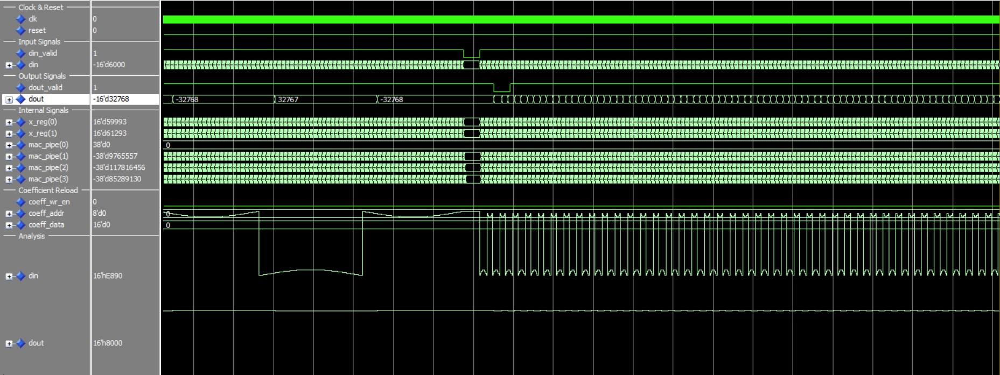

# DSP Core Project

This repository contains VHDL implementations for digital signal processing (DSP) modules, specifically **FIR** and **IIR filters** as well as **FFT** (Fast Fourier Transform). These cores are designed for use in FPGA/ASIC designs requiring real-time filtering and frequency analysis.

## Features

- **FIR Filter**
  - Parameterizable coefficients and data width.
  - Suitable for real-time signal processing applications.

- **IIR Filter**
  - Generic structure and customizable filter parameters.
  - Implements recursive filtering for higher order effects.

- **FFT Core**
  - Radix-2 FFT for efficient frequency domain transformation.

- **Reusable Type/Package Definitions**
  - Modular VHDL packages for data, coefficients, types.

## File Structure

- `src/fir_filter.vhd`: FIR filter module
- `src/iir_filter_generic.vhd`: IIR filter module
- `src/fft_radix2.vhd`: Radix-2 FFT core
- `src/pkg_dsp_types.vhd`, `src/pkg_iir_types.vhd`, `src/pkg_fft_types.vhd`, `src/pkg_coeffs.vhd`: Type and coefficient packages
- `src/tb_fir_filter.vhd`, `src/tb_iir_filter_comprehensive.vhd`, `src/tb_fftcomprehensive.vhd`: Testbenches for module validation
- `modelsim/sim.do`, `modelsim/sim_fft.do` and `modelsim/iir_sim.do` : Simulation scipts 
## Results

### FIR Filter

  

### IIR Filter

  
*(Insert your IIR result photo here after pushing.)*

## Usage

1. **Clone this repository**
2. Edit package files with your filter coefficients or data types
3. Simulate with your VHDL tools (e.g., Questasim)
4. Synthesize for your target FPGA/ASIC device
